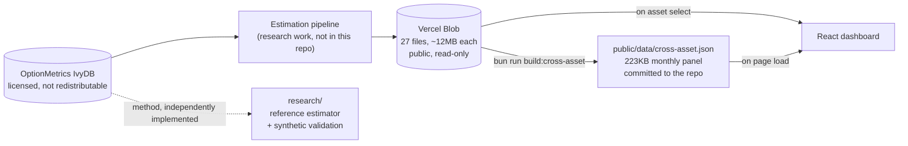

<div align="center">

<h1>Option-Implied Bubble Detection</h1>

<p><strong>Measuring how far the market traded from what its own options said it was worth.</strong></p>

<p>
Daily bubble estimates for the S&P 500 and 26 US equities, 1996&ndash;2023,<br/>
implementing the estimator from <a href="https://doi.org/10.1002/jae.2862">Jarrow &amp; Kwok (2021)</a>, <em>Journal of Applied Econometrics</em>.
</p>

<p>
<a href="https://financial-bubble.vercel.app"><strong>Open the dashboard</strong></a>
&nbsp;&middot;&nbsp;
<a href="research/">Read the estimator</a>
&nbsp;&middot;&nbsp;
<a href="#findings">Findings</a>
&nbsp;&middot;&nbsp;
<a href="CONTRIBUTING.md">Contribute</a>
</p>

<p>
<a href="https://github.com/lukaadzic/financial-bubble-detection-dashboard/actions/workflows/ci.yml"></a>


<a href="https://doi.org/10.1002/jae.2862"></a>
<a href="LICENSE"></a>
<a href="CONTRIBUTING.md"></a>
</p>

</div>

---

## The problem

A bubble is the gap between what an asset trades for and what it is worth. Everyone agrees on that definition and nobody agrees on the second number, because measuring fundamental value normally means committing to a model of it and then arguing about the model. That is why most bubble calls only arrive after the fact.

Jarrow and Kwok's method removes the argument. An asset's fundamental value is the discounted risk-neutral expectation of its future price, and the option market prices that expectation directly. You can read fundamental value off the option board instead of assuming it:

$$\hat{\Pi}_t(\tau) \;=\; \underbrace{S_t}_{\text{what it trades for}} \;-\; \underbrace{e^{-r\tau}\,\mathbb{E}^{\mathbb{Q}}_t\!\left[S_{t+\tau}\right]}_{\text{what the options say it is worth}}$$

No time series of past prices, no assumed dynamics, no filter that needs tuning. One cross-section of option prices on one day gives one estimate, with a confidence interval that comes from the disagreement between strikes.

This repository is that idea, twice: a **dashboard** over 27 assets and 27 years, and a **reference implementation** of the estimator with a validation harness that proves it recovers a bubble it is known to contain.

## Findings

Every number below is computed from the data in this repository and is reproducible from the code in `research/` and `scripts/`.

### The horizon you pick decides what you see

Estimates are grouped into three maturity windows because option liquidity clusters around common expiries. For the S&P 500, the 2006&ndash;07 pre-crisis run-up is plainly visible at one year and essentially absent at three months:

| Window | τ ≈ 0.25y | τ ≈ 0.5y | τ ≈ 1y |
|---|---:|---:|---:|
| Dot-com, 1999&ndash;2000Q1 | +0.11% | +0.29% | +0.35% |
| **Pre-GFC, 2006&ndash;Oct 2007** | **+0.15%** | **+0.56%** | **+1.28%** |
| Crisis, 2008&ndash;09 | −0.11% | −0.49% | −0.38% |
| COVID rebound, 2020&ndash;21 | +0.28% | +0.39% | +0.55% |

<sub>Combined put/call estimator, mean over the window, as a percentage of index level.</sub>

Anyone reading only the short horizon would have concluded nothing was happening before the GFC. This is the most important thing to understand before using these numbers, and it is why the dashboard makes the horizon a first-class control rather than a buried setting.

### Peak readings land on the episodes you would expect

Ranking every asset by its highest trailing-twelve-month reading, and asking when that peak occurred:

| Asset | Peak reading | 12-month window ending |
|---|---:|---|
| Amazon | +10.8% | 13 Mar 2000 |
| Tesla | +6.5% | 16 Jun 2021 |
| Cisco | +5.2% | 20 Jul 2000 |
| Apple | +4.3% | 20 Oct 2006 |
| AMD | +4.0% | 29 Jan 2021 |
| Intel | +3.8% | 24 Jul 2000 |

Amazon's most extreme twelve-month stretch ends three days after the Nasdaq Composite peaked on 10 March 2000. Cisco and Intel top out together that summer. Tesla and AMD peak inside the 2021 retail-speculation window. Nothing here is fitted to those dates; the estimator has no knowledge of them.

### It is not a short signal, and the paper never claimed it was

Sorting S&P 500 observations by bubble estimate and measuring the subsequent twelve-month return:

| Quintile | Bubble estimate | Mean forward 12m return | P(negative) |
|---|---|---:|---:|
| Q1 (lowest) | −5.67% to −0.14% | +5.5% | 36.9% |
| Q2 | −0.14% to +0.55% | +5.7% | 40.3% |
| Q3 | +0.55% to +0.97% | +10.2% | 13.4% |
| Q4 | +0.97% to +1.39% | +9.6% | 15.3% |
| Q5 (highest) | +1.39% to +2.87% | +10.9% | 16.4% |

High readings are followed by *higher* returns, not lower ones. That agrees with the paper, whose headline result is a strategy that rides bubbles rather than fading them, earning 8.7% a year against 5.1% for buy-and-hold.

**The caveat matters more than the table.** Those rows use overlapping twelve-month windows, so the 6,648 observations behind them are nowhere near independent. Repeating the test on non-overlapping annual observations leaves 27 data points, and the gap between above- and below-median readings (+12.0% against +5.5%) is not statistically significant: Welch t = 0.87, p = 0.39. The direction matches the paper. The sample in this repository cannot establish it alone, and the table should not be read as if it could.

## How to read the numbers

**The estimate is a price, not a probability.** Index points for the S&P 500, dollars for a single name. The dashboard divides by spot price by default, because a 50-point bubble on a 656-point index in 1996 and a 50-point bubble at 4,507 in 2023 are not the same event.

**Read the interval, not the midpoint.** Every estimate carries a confidence band. When it contains zero, the data cannot distinguish that day from no bubble at all. The dashboard says so in words rather than reporting the sign of a noisy number.

**Put-only and call-only bracket the combined series.** A call price bounds fundamental value from above and a put price bounds it from below, so the call-only series is a lower bound on the bubble and the put-only series an upper bound. Both are sharpest at deep in-the-money strikes, which are the least liquid contracts on the board, so both stay loose in practice. Read the combined series for a number, and the spread between the other two as a measure of how much the option market actually pins down. Derivation in [`research/README.md`](research/README.md).

## Provenance

The bubble estimates were produced as a research assistant to **Dr Simon Kwok** (School of Economics, University of Sydney), who developed the method with **Professor Robert Jarrow** (Cornell). The University of Sydney's write-up of the result is [here](https://www.sydney.edu.au/news-opinion/news/2021/08/05/how-to-predict-a-stock-market-bubble-in-real-time.html).

> Jarrow, R. A., & Kwok, S. S. (2021). Inferring financial bubbles from option data. *Journal of Applied Econometrics*, 36(7), 1013&ndash;1046. [doi:10.1002/jae.2862](https://doi.org/10.1002/jae.2862)

This repository is the visualization and an independent reference implementation. It is not the paper's own code, and the authors are not responsible for anything in it.

## Quick start

Nothing to configure. The dashboard reads from a public, read-only blob store.

```bash
git clone https://github.com/lukaadzic/financial-bubble-detection-dashboard
cd financial-bubble-detection-dashboard
bun install
bun run dev            # http://localhost:3000
```

The estimator is independent of the dashboard and needs no JavaScript toolchain:

```bash
python -m venv .venv && source .venv/bin/activate
pip install -r research/requirements.txt
pytest research -q     # 26 tests, under a second
```

## Architecture



The cross-asset panel exists because loading 27 files at 12MB each to draw one overview is not an option. It is a monthly derivative committed to the repo and regenerated with `bun run build:cross-asset`.

## The estimator

[`research/bubble.py`](research/bubble.py) implements the identity. Put-call parity recovers option-implied fundamental value at every strike at once:

$$V_t(\tau) = C(K) - P(K) + K e^{-r\tau}$$

In a frictionless market with no bubble, that expression equals the spot price and returns the same number at every strike. Two things break it, and the estimator reads one off each: microstructure noise scatters the estimate across strikes, which is what the confidence interval measures, and a bubble shifts the entire cross-section away from spot by the same amount, which is the point estimate.

That equivalence is not a metaphor. Under [Jarrow, Protter & Shimbo (2010)](https://doi.org/10.1111/j.1467-9965.2010.00394.x), a price process that is a strict local martingale rather than a true martingale violates put-call parity by exactly the bubble.

```python
import numpy as np
from research.bubble import estimate_bubble
from research.simulate import simulate_quotes

# A surface with a bubble of exactly 2.00 injected, plus 25bp of quote noise.
quotes = simulate_quotes(
    fundamental=100.0, bubble=2.0, noise_bps=25.0,
    rng=np.random.default_rng(42),
)

estimate = estimate_bubble(quotes)
print(f"spot         {quotes.spot:.2f}")            # spot         102.00
print(f"fundamental  {estimate.fundamental:.2f}")   # fundamental   99.92
print(f"bubble      {estimate.mu:+.3f}")            # bubble       +2.080
print(f"interval    [{estimate.lb:+.3f}, {estimate.ub:+.3f}]")  # [+1.875, +2.285]
print(f"significant  {estimate.significant}")       # significant  True
```

`quotes_from_arrays` takes real quotes in the same shape: spot, strikes, call and put mid prices, a rate and a maturity.

### Validation

There is no public option dataset to check against, because the estimates here derive from OptionMetrics IvyDB, which is licensed. So [`research/simulate.py`](research/simulate.py) generates surfaces whose bubble is known by construction: options are priced off a fundamental value `V`, then the traded spot is set to `S = V + bubble`, so put-call parity holds at `V` and fails at `S` by exactly the injected amount.

Over 2,000 independent surfaces with 25bp of quote noise and a true bubble of 2.00 on a fundamental of 100:

| Metric | Value |
|---|---:|
| Mean estimate | 1.9997 |
| Bias | −0.0003 |
| Standard deviation | 0.1005 |
| **95% interval coverage** | **94.5%** |

Coverage is the number that matters. An estimator that returns plausible values with intervals that never contain the truth is worse than no estimator, because it invites conclusions the data does not support. The test suite asserts both properties, plus parity in the pricer, invariance to maturity and rate, and that the one-sided bounds are never violated.

## Assets covered

27 assets, 1996&ndash;2023. Individual names begin when their options do: Tesla in 2010, Alibaba in 2014.

| Sector | Assets |
|---|---|
| Index | SPX |
| Technology | AAPL, MSFT, GOOG, AMZN, NVDA, INTC, CSCO, AMD, FB, BABA, TWTR |
| Financials | JPM, BAC, C, WFC, MS, AIG |
| Industrials and other | TSLA, F, GM, DIS, BA, GE, XOM, T |

## Known limitations

Documented rather than quietly hidden. Several are [open issues](https://github.com/lukaadzic/financial-bubble-detection-dashboard/issues) looking for a contributor.

**Payload size.** Each per-asset file is roughly 12MB and served uncompressed, so switching assets means a 12MB download. This is the largest single problem in the repository.

**GM is unreliable.** Its split-adjusted price is recorded as `0.00` through the June 2009 bankruptcy, and its estimates run between +30% and +110% of price across 2020&ndash;21, which is not a credible reading for any asset. The `bubblePercent` guard drops observations where the bubble exceeds the entire price, so those dates render as gaps, but GM's series should not be trusted as a whole.

**Confidence intervals assume independent quote noise across strikes.** They are not independent: adjacent strikes share market makers and move together, so the stated intervals are likely narrower than the truth.

**Not updated in real time.** The sample ends 31 August 2023.

**The reference implementation is not the full published estimator.** It reproduces the core identity and its cross-sectional standard error. The published version adds a nonparametric smoothing step across strikes; the `num_steps`, `optimization_threshold` and `h_number_sd` fields in the data's metadata come from that fuller pipeline.

## Contributing

Contributions are welcome, including from people who have never touched option pricing. The dashboard, the estimator and the docs need different skills and nobody needs all three.

[**CONTRIBUTING.md**](CONTRIBUTING.md) has the setup, the house style, and open work ranked by how much finance background it needs. Several items need none at all. [**ROADMAP.md**](ROADMAP.md) has the longer arc.

Good places to start:

- [`good first issue`](https://github.com/lukaadzic/financial-bubble-detection-dashboard/labels/good%20first%20issue) &mdash; scoped and self-contained, with pointers to the exact files
- [`help wanted`](https://github.com/lukaadzic/financial-bubble-detection-dashboard/labels/help%20wanted) &mdash; larger pieces that need an owner
- [Discussions](https://github.com/lukaadzic/financial-bubble-detection-dashboard/discussions) &mdash; questions about the method, or ideas before they become issues

Every pull request runs lint, typecheck, build and the Python test suite. `bun run check --write` fixes most formatting complaints on its own.

## Project layout

```
src/
  components/
    Dashboard.tsx           page shell and layout
    BubbleSummaryPanel.tsx  latest reading, read off the interval
    CrossAssetHeatmap.tsx   all 26 assets, full sample
    PlotlyBubbleChart.tsx   the estimate charts
    MethodologyNote.tsx     what the numbers mean, on the page
    usePlotlyTheme.ts       shared palette, lazy plotly loader
  hooks/useDashboardData.ts fetching and derived state
  utils/dataLoader.ts       blob fetching, transforms, summary stats
  types/bubbleData.ts       schema, asset list, percent-of-price guard
research/
  bubble.py                 the estimator
  simulate.py               synthetic surfaces with a known bubble
  test_bubble.py            recovery and coverage tests
scripts/
  build-cross-asset.ts      builds the heatmap's monthly panel
  upload-to-blob.ts         publishes new estimator output
public/data/
  cross-asset.json          223KB monthly panel, committed
```

## Data format

Per-asset estimator output is a single JSON document, keyed by ticker:

```typescript
{
  metadata: {
    stockcode: "SPX",
    rolling_window_days: 63,
    tau_groups_info: [{ name: "tau_1", range: "0.15-0.35", mean: 0.25 }, ...],
  },
  time_series_data: [{
    date: "1996-04-03T00:00:00",
    stock_prices: { adjusted: 655.88 },
    bubble_estimates: {
      // one entry per tau group, ordered to match tau_groups_info
      daily_grouped: [{
        put:      { mu: 9.18, lb: 2.68, ub: 9.88 },
        call:     { mu: 0.14, lb: -2.66, ub: 5.49 },
        combined: { mu: 5.72, lb: 2.89, ub: 6.39 },
      }, ...]
    }
  }, ...]
}
```

Full schema in [`src/types/bubbleData.ts`](src/types/bubbleData.ts). Publishing new estimator output is covered in [`docs/blob-storage.md`](docs/blob-storage.md).

## Stack

React 19, TypeScript, Vite 6, TanStack Router, Plotly.js, Tailwind 4, shadcn/ui, Biome, Bun, Vercel. The estimator is numpy, scipy and pytest, and nothing else.

Plotly loads on demand rather than in the entry bundle, since it is 4.6MB and nothing can be drawn until the data arrives anyway.

## Citation

If you use this work, cite the paper. If you specifically use this implementation, `CITATION.cff` is in the repository root and GitHub renders a "Cite this repository" button from it.

```bibtex
@article{jarrow2021inferring,
  title   = {Inferring financial bubbles from option data},
  author  = {Jarrow, Robert A. and Kwok, Simon S.},
  journal = {Journal of Applied Econometrics},
  volume  = {36},
  number  = {7},
  pages   = {1013--1046},
  year    = {2021},
  doi     = {10.1002/jae.2862}
}
```

## Licence

[Apache 2.0](LICENSE). The derived bubble series may be used under that licence; the underlying OptionMetrics option data may not be redistributed.

Research output, not investment advice.
